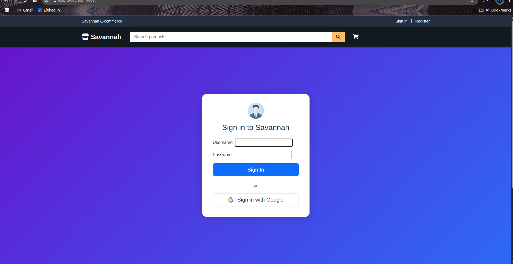

# UI Screenshots

This document contains screenshots of the various user interfaces in the Savannah E-commerce application.

## Main E-commerce Portal

### Home Page

*The main landing page of Savannah E-commerce*

*The home page with featured products and categories*

### Product Listing

*The product listing page showing all available products*

*Detailed product listing with filters and sorting options*

### Product Details

*Product detail page showing images, description, and add to cart functionality*

### Shopping Cart

*The shopping cart page showing items and checkout button*

### Order Process

*Order confirmation screen after successful checkout*

## API Documentation

### Swagger UI

*Interactive API documentation using Swagger UI, accessible at `/api/docs/`*

### ReDoc

*Alternative API documentation using ReDoc, accessible at `/api/redoc/`*

## Authentication

### Sign In

*The user login page with email and password options*

### Google Authentication

*Initial Google sign-in interface*

*Google authentication confirmation screen*

## Email Notifications

### Customer Email

*Order confirmation email sent to customers*

### Admin Email

*Order notification email sent to admin*
