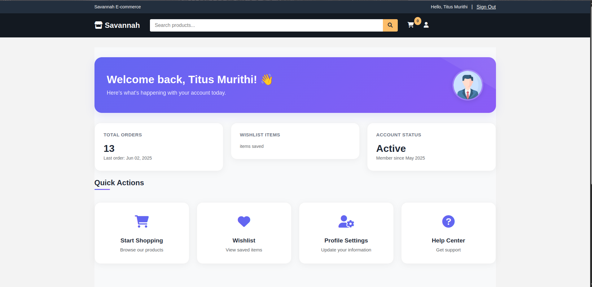

# UI Screenshots

This document contains screenshots of the various user interfaces in the Savannah E-commerce application.

## Main E-commerce Portal

### Home Page

*The main landing page of Savannah E-commerce*


*The home page with featured products and categories*

### Product Listing

*The product listing page showing all available products*


*Detailed product listing with filters and sorting options*

### Product Details

*Product detail page showing images, description, and add to cart functionality*

### Shopping Cart

*The shopping cart page showing items and checkout button*

### Order Process

*Order confirmation screen after successful checkout*

## Administration Interface

### Django Admin Dashboard
[Add screenshot of the Django admin dashboard showing the main navigation]

### Product Management
[Add screenshot of the product management interface in Django admin]

### Order Management
[Add screenshot of the order management interface showing order details and status]

## API Documentation

### Swagger UI

*Interactive API documentation using Swagger UI, accessible at `/api/docs/`*

### ReDoc

*Alternative API documentation using ReDoc, accessible at `/api/redoc/`*

## Authentication

### Sign In

*The user login page with email and password options*

### Google Authentication

*Initial Google sign-in interface*


*Google authentication confirmation screen*

## Email Notifications

### Customer Email

*Order confirmation email sent to customers*

### Admin Email

*Order notification email sent to admin*

## Mobile Responsiveness

### Mobile Home Page
[Add screenshot of the home page on a mobile device]

### Mobile Product View
[Add screenshot of the product view on a mobile device]

## Notes

- All screenshots were taken with the application running in production mode
- Screenshots are clear and properly cropped
- No sensitive information is visible in the screenshots
- Screenshot resolution: 1920x1080 or higher
- File format: PNG/JPG
- Maximum file size per screenshot: 2MB

## How to Take Screenshots

1. Start the application in production mode:
   ```bash
   python manage.py runserver --settings=savannah_ecommerce.settings.production
   ```

2. Use your browser's developer tools to:
   - Set the viewport to different screen sizes
   - Disable any browser extensions that might interfere
   - Use the browser's built-in screenshot tool or a third-party tool

3. For mobile screenshots:
   - Use the browser's device emulation
   - Or take screenshots on actual mobile devices

4. For the admin interface:
   - Log in as an admin user
   - Navigate to each section
   - Take screenshots of the main features

5. For API documentation:
   - Access the Swagger UI at `/api/docs/`
   - Access the ReDoc at `/api/redoc/`
   - Take screenshots of the main sections 